## About
This [**Arelle**](https://github.com/Arelle/Arelle) plugin is a personal project just to make my life easier while working with submissions made to SEC in XBRL format and is independent from Arelle project.  
So far the code in this project is atrocious, messy and unorganized because this started as an attempt to create a small database to store SEC submissions information then I started adding stuff that was not planned and see if it works! This plugin needs to be rewritten at some point, but for now it works for what it is, and it is still work in progress and unreliable.

Inspired from [xbrlDB](https://github.com/Arelle/Arelle/tree/master/arelle/plugin/xbrlDB) plugin, this plugin creates a database in either postgres, sqlite or MongoDB and stores information about SEC submitted filings in **XBRL** format available via [SEC XBRL Feeds](https://www.sec.gov/structureddata/rss-feeds-submitted-filings). This plugin does not load or parse submissions, it just stores information about these submissions, but it provides some functionalities through Arelle GUI and command line, available functionalities:  
* Search submissions by filer, form type, filing date, [SEC Standard Industry classification (SIC)](https://www.sec.gov/info/edgar/siccodes.htm)
* Render [Edgar interactive reports](https://github.com/Arelle/EdgarRenderer) locally for search results (via Arelle EdgarRenderer plugin) and web app to view and navigate the rendered reports.
* Run XBRL formulae on search results and store the formulae output
* Store search results in xbrlDB
* Save searches in rss feed format, that can be used later for whatever purpose 

An example use case for this plugin: if we are researching submissions made to the SEC, we can run an XBRL formulae to extract data points of interest on all submissions or submissions with specific criteria (search criteria), then store the formulae results, then we can examine these results and take further action if needed.

*****`IMPORTANT`**: This module gets its information from **Monthly** RSS feeds list available at: https://www.sec.gov/Archives/edgar/monthly/ and these are **NOT** all submissions made to the SEC, these are just submissions made in XBRL format.***

## Installation
This plugin depends on [arellepy](https://github.com/selgamal/arellepy), to be able to use this plugin, copy this repository and arellepy repository to Arelle plugin folder as follows:  
* If using Arelle from source, then copy to `~/Arelle/arelle/plugin/rssDB  ~/Arelle/arelle/plugin/arellepy`  
* If using Arelle application, then copy to `~/Arelle/plugin/rssDB ~/Arelle/plugin/arellepy`


This plugin is tested and kinda works on **Windows 10** and **Debian GNU/Linux 10 (buster)**, not for Mac though...

## Usage
### Arelle GUI 
*Launch rssDB*  
After copying the plugin folder to the appropriate location as noted above, from Arelle GUI add plugin from `Help > Manage Plug-ins > Select` then select `rssDB` from the list, the app will request to restart, then two additional icons should appear in the GUI tool bar:  
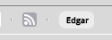  
The first button launches the rssDB panel, second button launches and viewer to view Edgar interactive reports generated locally through this plugin (it must be generated with this plugin for this viewer to work).  

*Connect to rssDB*  
If everything is working as it should an action panel will appear, probably we want to select `Connect To RSS DB`, all other options are disabled because we do not have a connection to the database.  
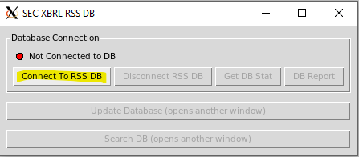  
That will open the connection Dialogue, We can connect to an existing DB or create new DB with all the required tables, we can create a new DB if MongoDB or sqlite selected as product given user has appropriate privileges on the MongoDB server and file system, for postgres, a database must exist then we can create new schema and tables in that DB also given user has the appropriate privileges on postgres server. `Note` PyMongo package is not included with Arelle app, if MongoDB is selected the user will be prompted for the location of an installation of this package, can be python virtual environment, but python major version must match that of Arelle's.   
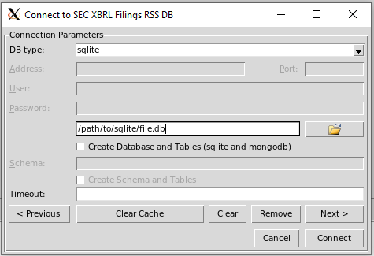  
Enter all required fields then click connect.   

*Do Stuff*  
If everything went okay, then we should see the options are now available in the DB panel, there are few things we can do:  
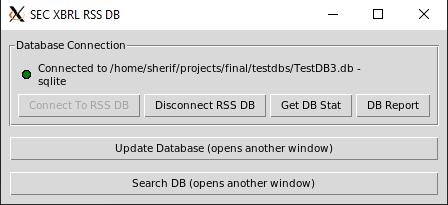  
1. Disconnect from DB
2. `Get DB Stat`: Show database statistics in Arelle message panel
3. `DB Report`: Starts a web app (plotly-dash) that shows some information about the data, this will require plotly-dash, pandas and other packages that are not included with Arelle app, user will be prompted to give a path to an installation of these packages, maybe a virtual python environment site-packages folder, python major version must match that of Arelle's.  
   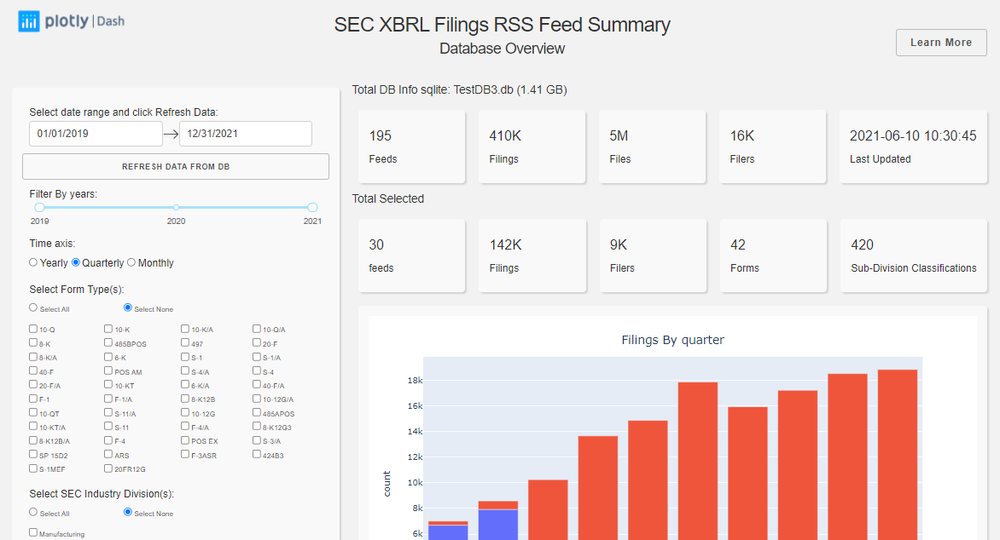 
4. `Update Database`: opens up a dialogue to update the database, this means fetching all new submissions information, here I would just take the defaults and click `Update DB`, note that this uses multiprocessing if using linux, so recommended to set the `Max Processes` to half available processors number, also this might take a really long long time in the initial load (30-60 mins based on internet connection and processing power).  
   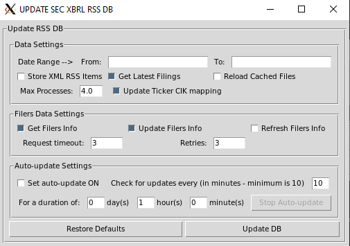 
5. `Search DB`: Here we can input search parameters for the submissions we are looking for, for example:  
   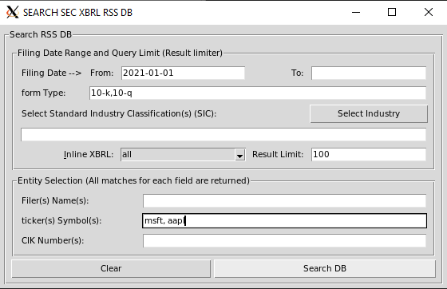  
   and the result will appear in Arelle main panel:  
   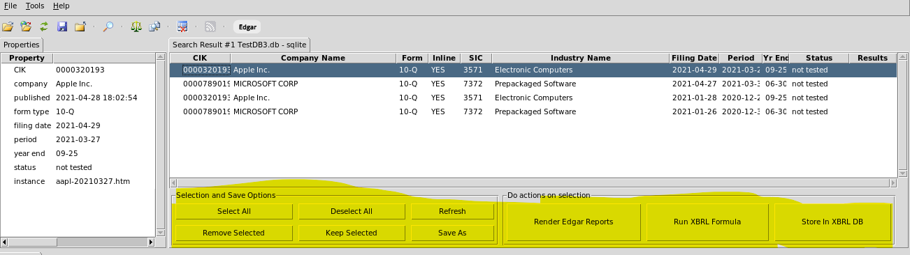  
   Here we have few extra options for things to do with the search results, the group on the right hand side for selection and saving the results, on the left hand side we can render Edgar interactive reports, run formulae (either from file or from formulae stored in the rss DB), or we can store the search results in XbrlDB.  
   * `Render Edgar reports` requires a folder to save the reports into, and thats it, when its done, it will open a viewer, this viewer needs a folder that contains the rendered reports:
  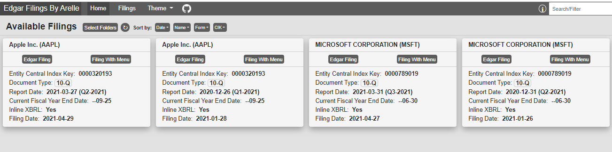  
   * `Run XBRL Formula` opens a dialogue to add/remove XBRL formulae linkbase to rssDB, those formulae can be run on the selected submission and the results stored in the rssDB  
   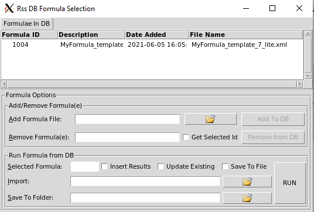
   * `Store In xbrlDB` opens up the store in XbrlDB dialogue and stores all selected filings based on the xbrlDB options selected:  
    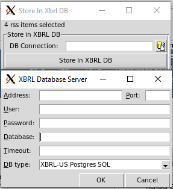

### Arelle Command Line
For help on commands:
```shell
./arelleCmdLine --plugin rssDB --help
```

All the above steps from Arelle GUI can be done from command line as follows:
```shell
./projects/final/Arelle_app/arelleCmdLine --plugin "arellepy|xbrlDB|EdgarRenderer|rssDB" --rssDBdatabase /path/to/sqlite/rssDB/file.db --rssDBproduct sqlite --rssDBconnect --rssDBupdate --rssDBreportlaunch  --rssDBsearch --rssDBsearchformType 10-k,10-q --rssDBsearchtickerSymbol msft,aapl --rssDBsearchdateFrom 2021-01-01 --rssDBSearchrenderEdgarReports --rssDBsearchEdgarRenderFolder /path/to/folder/to/save/Edgar/reports/output --rssDBsearchEdgarViewer --rssDBStoreSearchResultsIntoXBRLDB server,port,username,password,dbname,timeout,product
```
The above command preforms the follows:
1. Updates the rssDB database, and starts database report
2. Performs a search for forms 10-Q and 1-K submitted by Microsoft and Apple from Jan. 1, 2021 and 
3. Render Edgar interactive reports for the search results, and opens Edgar viewer locally
4. Stores the submissions from the search results into xbrlDB  

## An Example MS Power BI report based on the database created by this plugin
<figure class="video_container">
<iframe width="600" height="373.5" src="https://app.powerbi.com/view?r=eyJrIjoiNDNhNWNkMjItY2ZlOS00YjJjLTg2MWEtMjFiMGI4YmU3MTBkIiwidCI6ImMwMzMzYzA0LTJhZGItNDY0Ny1iOWJlLTEyODUxY2U3MGI4NyIsImMiOjh9&embedImagePlaceholder=true&pageName=ReportSectione29712ebca87fe362af8" frameborder="0" allowFullScreen="true"></iframe>
</figure>

**DISCLAIMER:** The code in this project was created for research and personal use purposes **ONLY**, is provided as is without any guarantees or implied or express warranties. This project depends and uses code from [Arelle project](https://github.com/Arelle/Arelle) but is NOT a part of that project.

### License
This project is licensed under same license, terms and conditions for [Arelle License](https://github.com/selgamal/Arelle/blob/master/License.txt), in addition to any terms, conditions, notices and disclaimers in this document.  


